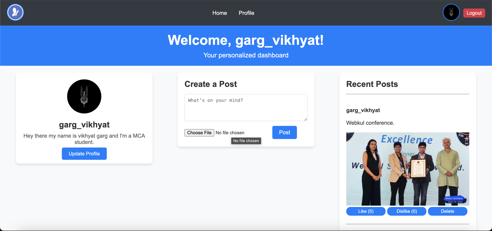

# Social Network Project

A feature-rich social networking platform built using **PHP**, **MySQL**, **jQuery**, and AJAX. This platform includes functionalities for creating posts, liking/disliking posts, uploading images, user profile management, and much more.

---

## Table of Contents
- [Features](#features)
- [Technologies Used](#technologies-used)
- [Database Schema](#database-schema)
- [Installation](#installation)
- [Usage](#usage)
- [Project Structure](#project-structure)
- [Screenshots](#screenshots)
- [License](#license)

---

## Features
- **User Authentication**: Secure login and registration system with profile picture upload.
- **Post System**:
  - Users can create, edit, and delete posts.
  - Add images to posts.
- **Like/Dislike Functionality**: Toggle likes and dislikes on posts using AJAX.
- **User Profiles**:
  - Display profile picture, username, and bio.
  - Editable profile information.
- **Responsive Design**: Compatible with both desktop and mobile devices.

---

## Technologies Used
- **Backend**: PHP (Object-Oriented)
- **Frontend**: HTML, CSS, JavaScript (jQuery, AJAX)
- **Database**: MySQL
- **Server**: Apache (XAMPP)

---

## Database Schema
### Users Table
| Column          | Type         | Description                    |
|-----------------|--------------|--------------------------------|
| `id`            | INT (PK)     | Unique user ID                |
| `username`      | VARCHAR(255) | Username                      |
| `email`         | VARCHAR(255) | User email                    |
| `password`      | VARCHAR(255) | Hashed password               |
| `profile_picture` | VARCHAR(255) | Path to profile picture       |
| `bio`           | TEXT         | User bio                      |

### Posts Table
| Column          | Type         | Description                    |
|-----------------|--------------|--------------------------------|
| `id`            | INT (PK)     | Unique post ID                |
| `user_id`       | INT (FK)     | ID of the user who created it |
| `content`       | TEXT         | Post content                  |
| `image_path`    | VARCHAR(255) | Path to uploaded image        |
| `created_at`    | TIMESTAMP    | Time of post creation         |

### Likes Table
| Column          | Type         | Description                    |
|-----------------|--------------|--------------------------------|
| `id`            | INT (PK)     | Unique like ID                |
| `user_id`       | INT (FK)     | ID of the user                |
| `post_id`       | INT (FK)     | ID of the post                |
| `like_status`   | TINYINT(1)   | 1 for like, 0 for dislike     |

---

## Installation

### Prerequisites
- **XAMPP** or any LAMP/WAMP stack.
- Web browser.

### Steps
1. Clone the repository:
   ```bash
   git clone https://github.com/yourusername/social-network.git
   ```
2. Move the project folder to your server's root directory (e.g., `htdocs` for XAMPP).
3. Create a MySQL database named `social_network`.
4. Import the `social_network.sql` file into the database.
5. Update the database configuration in `db.php`:
   ```php
   $conn = new mysqli('localhost', 'root', '', 'social_network');
   ```
6. Start your Apache and MySQL servers.
7. Open the application in your browser:
   ```
   http://localhost/social-network
   ```

---

## Usage
1. **Register** an account.
2. **Login** to access the dashboard.
3. **Create posts**, upload images, and view posts from other users.
4. **Like/Dislike** posts.
5. Update your profile information, including bio and profile picture.

---

## Project Structure
```
project/
|-- assets/             # CSS, images, and frontend assets
|-- controllers/        # Handles backend logic
|   |-- PostController.php
|   |-- LikeController.php
|-- uploads/            # Stores uploaded images
|-- views/              # Contains HTML and frontend files
|-- db.php              # Database connection file
|-- index.php           # Entry point (login/register)
|-- dashboard.php       # Main user dashboard
|-- README.md           # Project documentation
```

---

## Screenshots
### 1. User Dashboard


### 2. Profile Section


### 3. Create a Post


---

## License
This project is licensed under the MIT License. See the LICENSE file for details.

---

Enjoy building and exploring the social networking platform! 🎉

